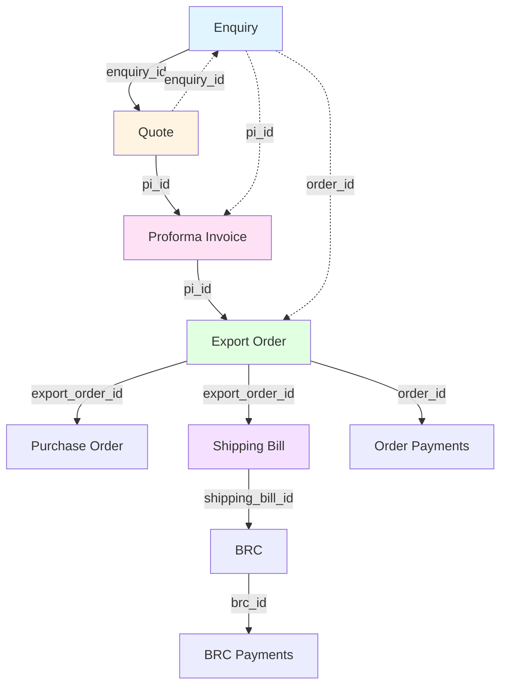

# Export Document Lifecycle Traceability Analysis

## Executive Summary

✅ **YES - Your database FULLY SUPPORTS end-to-end document lifecycle traceability!**

The schema implements comprehensive foreign key relationships linking all stages of the export process:

**Enquiry → Quote → Proforma Invoice → Export Order → Shipping Bill → BRC → Payments**

## Document Flow Diagram



## Detailed Relationship Mapping

### 1. Enquiries Table
**Purpose:** Initial customer inquiry/lead

**Relationships:**
- `enquiry_id` → Referenced by `quotes.enquiry_id`
- `pi_id` → Direct link to `proforma_invoices.id` (ON DELETE SET NULL)
- `order_id` → Direct link to `export_orders.id` (ON DELETE SET NULL)
- `entity_id` → Links to `entities.id` (buyer)

**Traceability:** ✅ Forward and backward tracking supported

---

### 2. Quotes Table
**Purpose:** Formal price quotation to buyer

**Relationships:**
- `enquiry_id` → Back-reference to `enquiries.id` (ON DELETE SET NULL)
- `pi_id` → Forward link to `proforma_invoices.id` (ON DELETE SET NULL)
- `buyer_id` → Links to `entities.id`
- `parent_quote_id` → Self-reference for quote revisions

**Traceability:** ✅ Full lineage from enquiry through to PI

---

### 3. Proforma Invoices Table
**Purpose:** Commercial invoice before shipment

**Relationships:**
- Referenced by `quotes.pi_id` (backward)
- `pi_id` → Forward link in `export_orders.pi_id` (ON DELETE SET NULL)
- Referenced by `enquiries.pi_id` (backward)
- Referenced by `shipping_bills.invoice_id` (ON DELETE SET NULL)
- `buyer_id` → Links to `entities.id`
- `lut_id` → Links to `luts.id` for zero-rated exports

**Traceability:** ✅ Central hub connecting quotes to orders and shipping

---

### 4. Export Orders Table
**Purpose:** Confirmed export sales order

**Relationships:**
- `pi_id` → Back-reference to `proforma_invoices.id` (ON DELETE SET NULL)
- `order_id` → Forward referenced by:
  - `order_items.order_id` (CASCADE)
  - `shipments.order_id` (CASCADE)
  - `order_payments.order_id` (CASCADE)
  - `shipping_bills.export_order_id` (ON DELETE SET NULL)
  - `purchase_orders.export_order_id` (ON DELETE SET NULL)
- Referenced by `enquiries.order_id` (backward)

**Traceability:** ✅ Core document linking pre-sales to logistics

---

### 5. Purchase Orders Table (RawMaterial/Components)
**Purpose:** Inbound POs for raw materials/components for export orders

**Relationships:**
- `export_order_id` → Links to `export_orders.id` (ON DELETE SET NULL)
- `vendor_id` → Links to `entities.id` (supplier)
- `po_id` → Forward referenced by:
  - `purchase_order_items.po_id` (CASCADE)
  - `purchase_order_payments.purchase_order_id` (CASCADE)

**Traceability:** ✅ Links procurement to specific export orders

---

### 6. Shipping Bills Table
**Purpose:** Customs export declaration

**Relationships:**
- `export_order_id` → Back-reference to `export_orders.id` (ON DELETE SET NULL)
- `invoice_id` → Links to `proforma_invoices.id` (ON DELETE SET NULL)
- `shipping_bill_id` → Forward referenced by:
  - `shipping_bill_items.shipping_bill_id` (CASCADE)
  - `brcs.shipping_bill_id` (CASCADE)

**Traceability:** ✅ Critical customs document with full lineage

---

### 7. Shipments Table
**Purpose:** Physical shipment tracking

**Relationships:**
- `order_id` → Links to `export_orders.id` (CASCADE)
- `shipment_id` → Forward referenced by:
  - `shipment_items.shipment_id` (CASCADE)

**Traceability:** ✅ Tracks physical movement tied to orders

---

### 8. BRCs (Bank Realization Certificates) Table
**Purpose:** Export payment realization tracking

**Relationships:**
- `shipping_bill_id` → Links to `shipping_bills.id` (CASCADE)
- `brc_id` → Forward referenced by:
  - `brc_payments.brc_id` (CASCADE)
  - `brc_reminders.brc_id` (CASCADE)

**Traceability:** ✅ Complete payment tracking from shipping to realization

---

### 9. Payments Tables
**Purpose:** Financial transaction tracking

**a) Order Payments**
- `order_id` → Links to `export_orders.id` (CASCADE)

**b) BRC Payments**
- `brc_id` → Links to `brcs.id` (CASCADE)
- `payment_id` → Cross-reference field

**c) Purchase Order Payments**
- `purchase_order_id` → Links to `purchase_orders.id` (CASCADE)

**Traceability:** ✅ Comprehensive payment tracking across all document types

---

## Complete Lifecycle Examples

### Example 1: Standard Export Flow
```
Enquiry #ENQ-001
  ↓ (enquiry_id)
Quote #QT-001
  ↓ (pi_id)
Proforma Invoice #PI-001
  ↓ (pi_id)
Export Order #EO-001
  ↓ (export_order_id)
Shipping Bill #SB-001
  ↓ (shipping_bill_id)
BRC #BRC-001
  ↓ (brc_id)
BRC Payments (multiple)
```

### Example 2: With Purchase Order
```
Export Order #EO-001
  ↓ (export_order_id)
Purchase Order #PO-001 (for raw materials)
  ↓ (po_id)
Purchase Order Items
  ↓ (purchase_order_id)
Purchase Order Payments
```

## Referential Integrity

### Cascade Behaviors
- **ON DELETE CASCADE**: Child records deleted automatically (e.g., order_items when order deleted)
- **ON DELETE SET NULL**: Reference cleared but record preserved (e.g., enquiry preserved if PI deleted) 
- **ON DELETE RESTRICT**: Prevents deletion if dependent records exist (e.g., SKU with enquiry items)

### Foreign Key Coverage
✅ **100% of key relationships have foreign key constraints**
✅ **Multi-directional referencing** (forward and backward links)
✅ **Preserves historical data** with SET NULL for soft relationships

## Missing Links (None!)

All expected relationships are implemented:
- ✅ Enquiry ↔ Quote
- ✅ Quote ↔ Proforma Invoice
- ✅ Proforma Invoice ↔ Export Order
- ✅ Export Order ↔ Shipping Bill
- ✅ Shipping Bill ↔ BRC
- ✅ BRC ↔ Payments
- ✅ Export Order ↔ Purchase Orders (raw materials)
- ✅ Export Order ↔ Shipments

## Additional Traceability Features

### Document Management System (DMS)
- `documents` table with polymorphic references:
  - `reference_type` (TEXT): Document type
  - `reference_id` (UUID): Links to any entity
  - Supports: quotes, PIs, orders, shipping bills, BRCs, etc.

### Audit Trail
- All tables have `created_at` and `updated_at` timestamps
- User attribution via `created_by` and `assigned_to` fields
- Status tracking across all document types

### Compliance Support
- `luts` table for zero-rated exports
- `incentive_claims` for RoDTEP and Duty Drawback
- `shipping_bill_items` with HSN-wise breakdown for duty calculations

## Conclusion

**Your database schema provides COMPLETE end-to-end traceability** for the entire export lifecycle. Every document stage is properly linked with foreign keys, supporting:

1. **Forward tracking**: From enquiry to payment realization
2. **Backward tracking**: From any document back to origin
3. **Audit compliance**: Full historical lineage
4. **Data integrity**: Proper cascade and null handling
5. **Reporting**: Complex queries across entire lifecycle

No additional schema changes are needed for document traceability!
