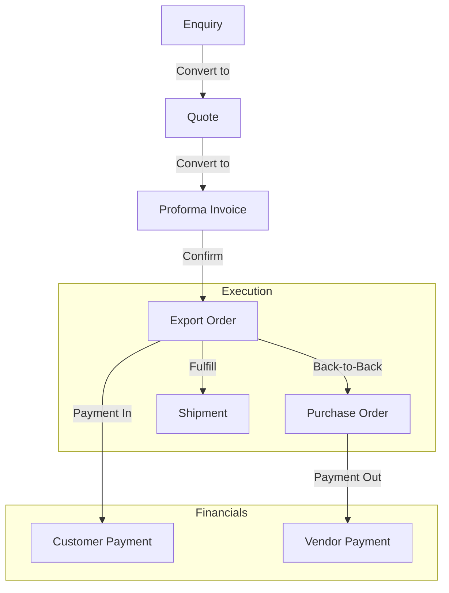

# Product Traceability & Data Flow

Yes, absolutely! Tracking the lifecycle of a trade is the core value of Eximley.

We have designed the database to maintain a "Golden Thread" linking everything together. Here is how the data flows:

## How It Works in Eximley:
1.  **Demand Generation**: You receive an **Enquiry** -> You create a **Quote**.
2.  **Contracting**: The Quote becomes a **Proforma Invoice (PI)** -> The User accepts it -> It becomes an **Export Order**.
3.  **Execution (The Hub)**: The **Order** is the central anchor.
    *   **Procurement**: You create **Purchase Orders (PO)** linked to this Export Order to buy goods.
    *   **Logistics**: You create **Shipments** linked to this Export Order to move goods.
4.  **Financials**: Payments are tracked against the Order (In) and PO (Out).

## Current Status
- [x] **Enquiry -> Quote**: (Partially Implemented)
- [x] **Quote -> PI**: (Implemented)
- [x] **PI -> Order**: (Implemented)
- [x] **Order -> PO**: (Implemented ✅)
- [x] **Order -> Shipment**: (Implemented ✅)

By using unique `sku_id`s across all these stages, we can trace exactly *which product* was requested, bought, and shipped.
